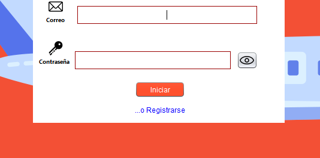

# Aplicación de gestion de reservas de vuelos

## Descripción
Este proyecto se trata de un administrador de reservas para vuelo, con 2 vistas tanto para el administrador principal como para el cliente, donde se acceden a 2 diferentes formas de menús para la accesibilidad de ambos roles de usuarios.

## Bibliotecas externas usadas:
- **JBCrypt:** encriptación de contraseñas.
- **JCalendar:** selección de fechas en la creacion de vuelos.
- **Itextpdf y Mail:** creación y envio de un pdf para notificar a los clientes de sus reservas por medio de correo electronico.
- **Libreria:** libreria personalizada para componentes visuales.

## Funcionamiento general
- Inicio de sesión
  

Dentro de esta ventana podran iniciar sesión tanto los adminitradores como los clientes y tambien lo clientes podran registrarse el la pequeña pestana de abajo para abrir el formulario de registro. 

- Registro
  

En esta ventana los clientes podran poner tanto sus datos personales como su registro para iniciar sesión, las diferentes entradas tienen validaciones para perimitir letras/números y correos y contraseñas validas, que pueden ser cambiadas en la clase `validaciones` del paquete `utileria` dentro del proyecto

Se podra regresar a la pestaña de login por medio de la pestaña de abajo.

- 
