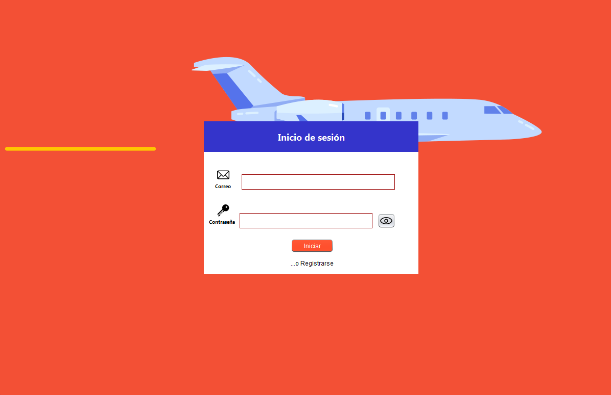
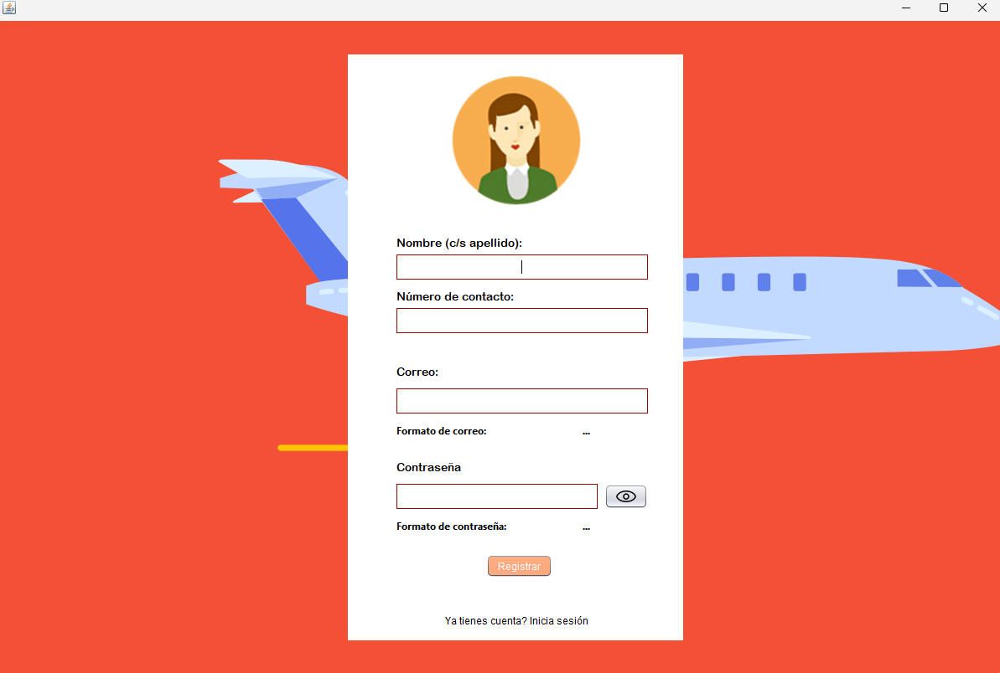
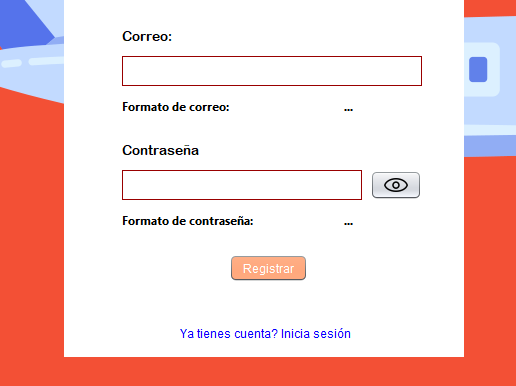
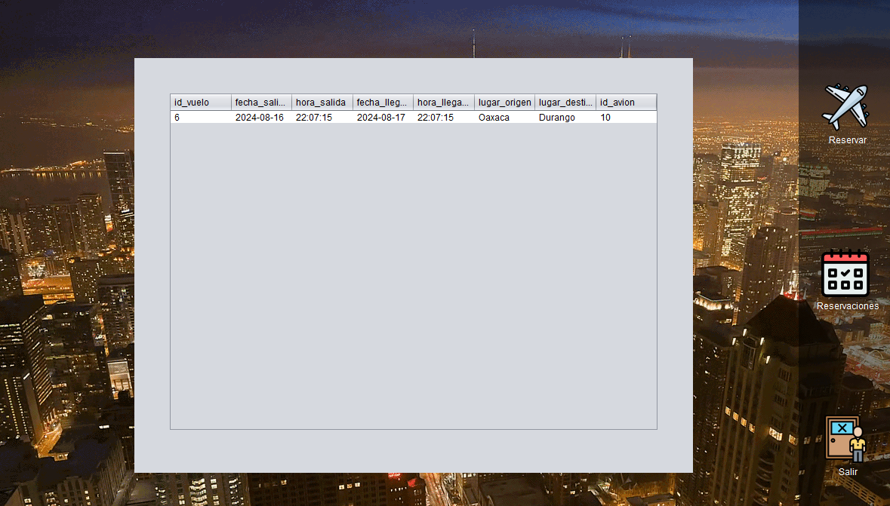
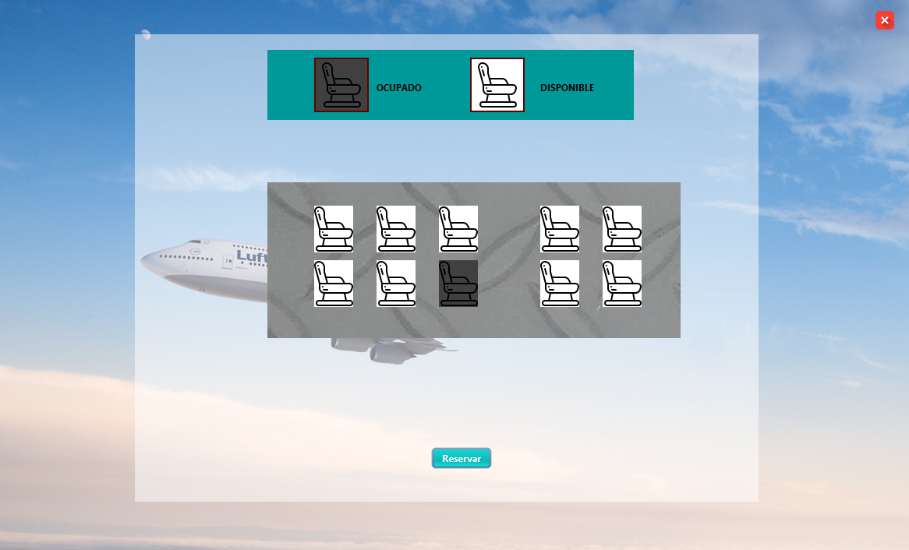
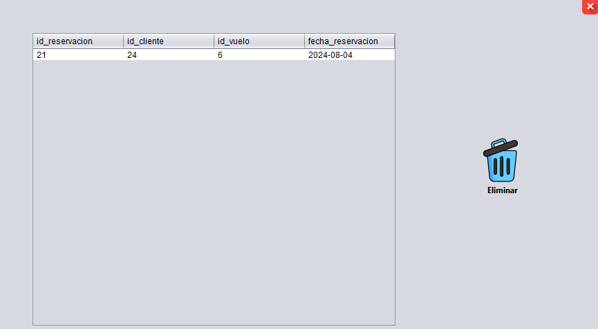
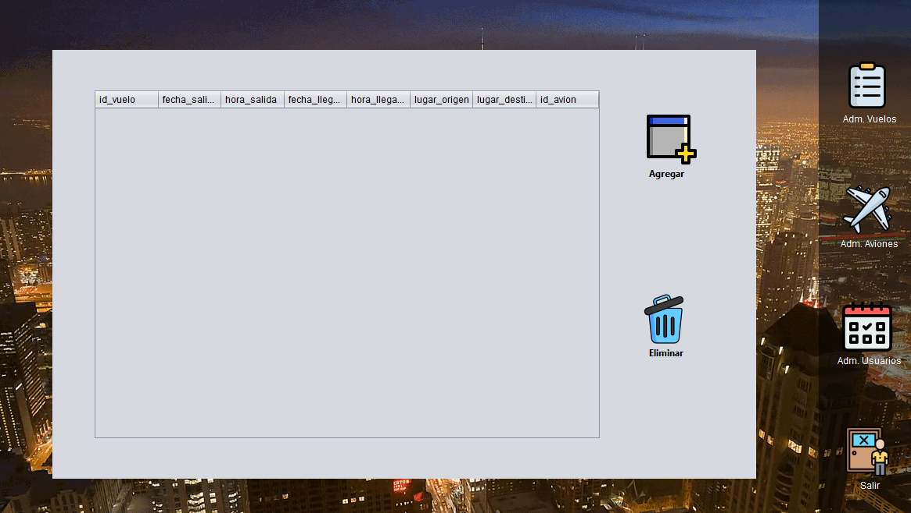
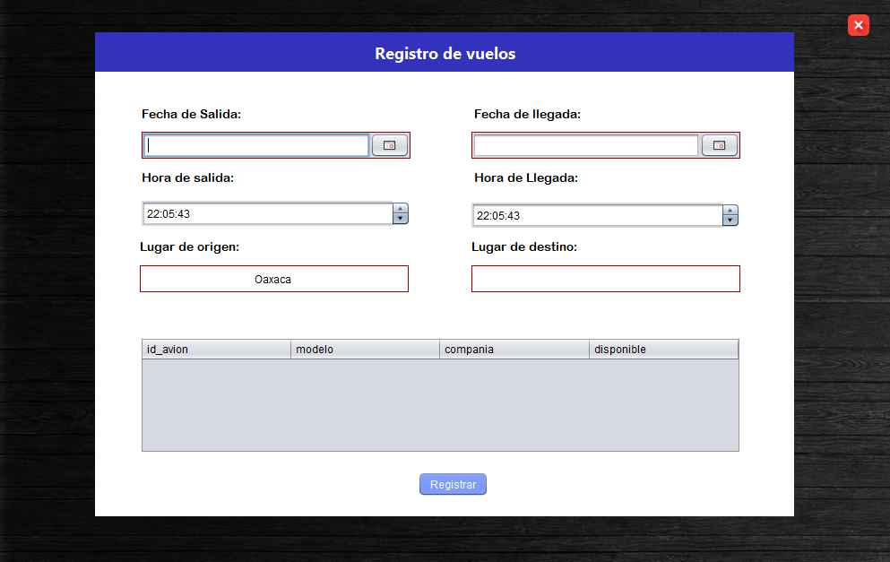
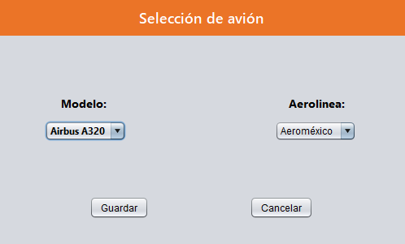
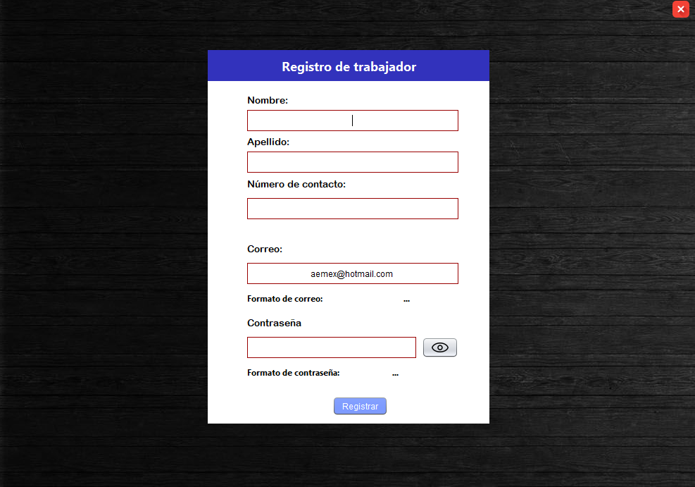

# Aplicación de gestion de reservas de vuelos

## Descripción
Este proyecto se trata de un administrador de reservas para vuelo, con 2 vistas tanto para el administrador principal como para el cliente, donde se acceden a 2 diferentes formas de menús para la accesibilidad de ambos roles de usuarios.

## Bibliotecas externas usadas:
- **JBCrypt:** encriptación de contraseñas.
- **JCalendar:** selección de fechas en la creacion de vuelos.
- **Itextpdf y Mail:** creación y envio de un pdf para notificar a los clientes de sus reservas por medio de correo electronico.
- **Libreria:** libreria personalizada para componentes visuales.

## Funcionamiento general
- Inicio de sesión
  

Dentro de esta ventana podran iniciar sesión tanto los adminitradores como los clientes y tambien lo clientes podran registrarse el la pequeña pestana de abajo para abrir el formulario de registro. 

### Vista del cliente

- Registro
  

En esta ventana los clientes podran poner tanto sus datos personales como su registro para iniciar sesión, las diferentes entradas tienen validaciones para perimitir letras/números y correos y contraseñas validas, que pueden ser cambiadas en la clase `validaciones` del paquete `utileria` dentro del proyecto

Se podra regresar a la pestaña de login por medio de la pestaña de abajo.

- Vista del cliente

En la ventana el cliente tendra 2 opciones para interactuar, **la reservacion** donde tendra que elegir un vuelo disponible que este dentro de la lista para poder acceder a los asientos disponibles de dicho vuelo:

Y la otra opción la cual es **Reservaciones** donde podra ver una lista con aquellas reservaciones que ya haya realizado y podra eliminarlas.

### Vista del administrador

- Administración
En cuyo caso que entre un adminitrador con exito aparecera una ventana con diferentes opciones.

**Admin. vuelos** donde se podran agregar nuevos vuelos a la tabla disponible para el cliente para ampliar sus opciones de selección, para poder registrar un vuelo se necesita de un avión que en ese momento se encuentre disponible.

**Admin. aviones** una pequeña pestaña donde el administrador podra agregar un avión a la tabla solo eligiendo el modelo y la aerolinea correspondiente, dentro de la base de datos se crean automaticamente los sientos de este avión (predeterminados a 10 asientos x avión).

**Admin. Usuarios** un formulario que de igual forma que en la vista de clientes, sirve para agregar un nuevo usuario, pero en este caso un admnistrador nuevo, de igual forma cuenta con validaciones en cada recuadro de texto.

**Creadores:**
- Kevin Peralta Nava Peralta
- Cristian Eduardo Mendoza Ramirez
